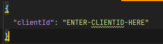

# LoRPresence
Simple Discord Rich Presence for Legends of Runeterra
w
## How To Use
You need to have Node.js

Right now I didn't set up an automatic start up, so you need to start it manually via Node.js
- Clone this Project
- create a config.json and add a discord Application on it, name the Application "Legends of Runeterra"
- get the client ID and enter it in the config.json (like the example below)

(if you use the project from the source code and not the releases tab, you need to add some extra values in the config file)

- open your terminal in this directory and run the app.js (node index)

If you do all these steps you are good to go, remember that the game should run when you use this, but I will probably fix this problem in the future.

## TO-DO
- [x] In Menu Presence
- [x] In Game Presence
- [ ] check Data dragon
- [x] Startup check (only source, not releases)
- [ ] Presence Assets
- [ ] Auto Run and Auto Setup

## Disclaimer
This is one of my first stand alone JS projects, so of course this code is trash, if you want to help and fix this mess, make a pull request. Thanks :)
